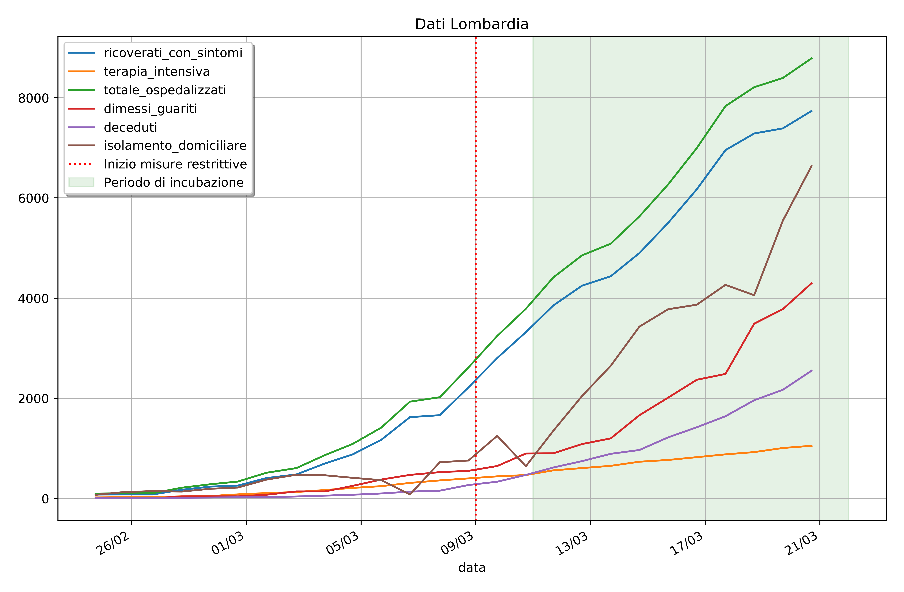
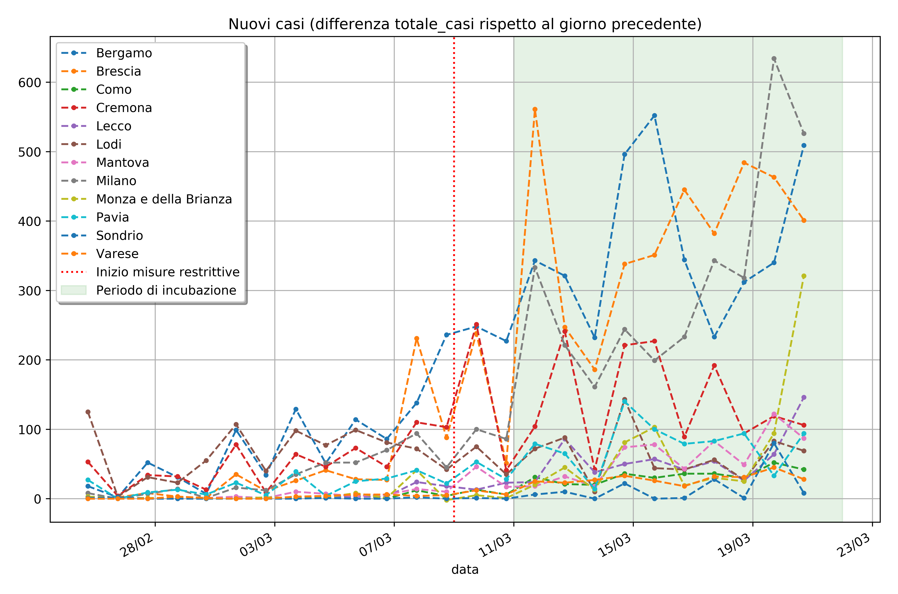

# Grafici e dati sull'epidemia di COVID-19 in Lombardia

I grafici sono stati generati a partire dai dati forniti dalla [Protezione Civile](https://github.com/pcm-dpc/COVID-19) sotto licenza [CC-BY-4.0](https://creativecommons.org/licenses/by/4.0/deed.en)

## Dati complessivi Lombardia

## Dati per provincia

## Correlazione

### Correlazione del numero dei nuovi contagiati rispetto all'entrata in vigore delle misure restrittive

|    | Provincia              |   Correlazione |  p-value |
|---:|:----------------------|------------:|---------------:|
|  0 | Bergamo               |   0.835877  |    1.97541e-07 |
|  1 | Brescia               |   0.825811  |    3.71675e-07 |
|  2 | Como                  |   0.841287  |    1.38179e-07 |
|  3 | Cremona               |   0.634034  |    0.000665754 |
|  4 | Lecco                 |   0.698422  |    0.000103302 |
|  5 | Lodi                  |  -0.0525226 |    0.803098    |
|  6 | Mantova               |   0.754392  |    1.32328e-05 |
|  7 | Milano                |   0.753188  |    1.39081e-05 |
|  8 | Monza e della Brianza |   0.443595  |    0.0263414   |
|  9 | Pavia                 |   0.723738  |    4.3325e-05  |
| 10 | Sondrio               |   0.381836  |    0.0596297   |
| 11 | Varese                |   0.855604  |    5.01628e-08 |

### Correlazione del numero dei nuovi contagiati rispetto ai giorni di distanza dall'entrata in vigore delle misure restrittive

|    | Provincia              |   Correlazione |  p-value |
|---:|:----------------------|----------------:|-------------------:|
|  0 | Bergamo               |       0.399939  |        0.197692    |
|  1 | Brescia               |       0.562401  |        0.0569821   |
|  2 | Como                  |       0.834839  |        0.000728337 |
|  3 | Cremona               |      -0.172884  |        0.59105     |
|  4 | Lecco                 |       0.596183  |        0.0407615   |
|  5 | Lodi                  |      -0.0409738 |        0.899391    |
|  6 | Mantova               |       0.739027  |        0.00603077  |
|  7 | Milano                |       0.79682   |        0.00191706  |
|  8 | Monza e della Brianza |       0.616021  |        0.032937    |
|  9 | Pavia                 |       0.299851  |        0.343691    |
| 10 | Sondrio               |       0.456847  |        0.135426    |
| 11 | Varese                |       0.715991  |        0.00882034  |

